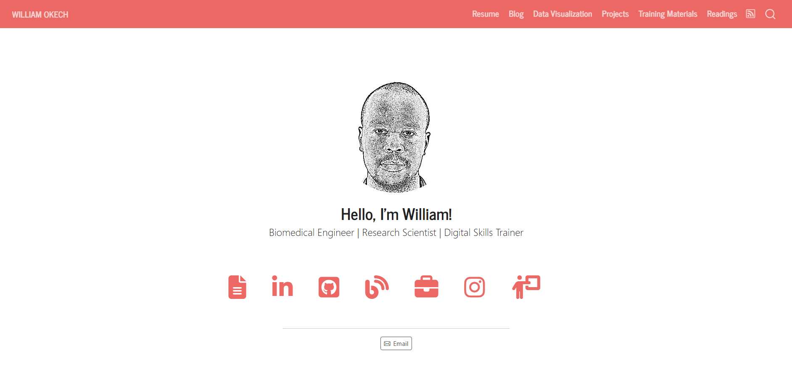

# William Okech's Personal Website

## Summary

I am a research scientist, science editor, and data literacy trainer with a background in Biomedical Engineering. My primary interests include:

• Biotechnology and Bioengineering

• Data Science and Data Visualization

In the blog section, I hope to introduce readers to the basics of data analysis and visualization, and provide a periodic summary of recent advances in biotechnology and bioengineering.

Additionally, the portfolio section showcases some of my projects and work on social media.

Lastly, the resources section offers a list of curated website links that address a wide variety of topics in STEM.

Developed using Quarto by Posit/RStudio

Hosted on: [NameCheap](https://www.williamokech.com/) and [Netlify](https://williamokech.netlify.app/)
